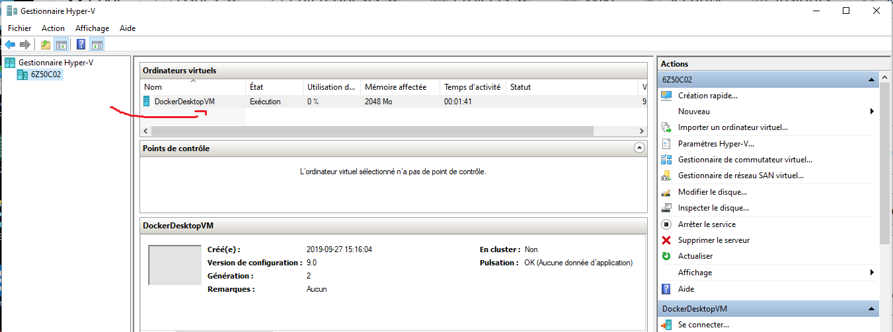
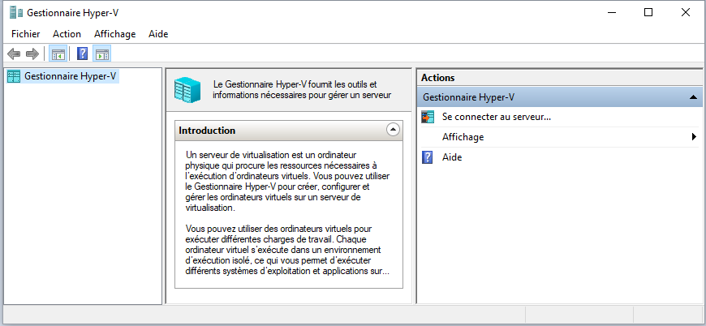

# Hyper-V


# :a: Install Docker Engine on Windows Server 

:pushpin: Dans @PowerShell

:one: Installer le module `DockerMsftProvider`

```
PS > Install-Module -Name DockerMsftProvider -Repository PSGallery -Force
```

:two: Installer le package `Docker`

```
PS > Install-Package -Name docker -ProviderName DockerMsftProvider
```

:three: Redémarrer le serveur

```
PS > Restart-Computer -Force
```

# :b: Install [HNS](https://docs.microsoft.com/en-us/virtualization/windowscontainers/container-networking/architecture) (Uniquement si vous avez installé Hyper-V Server)

:four: Enable Virtualization

```
PS > # Enable features required (HNS - Host Netwok Service)
PS > Enable-WindowsOptionalFeature -Online -FeatureName HypervisorPlatform
PS > Enable-WindowsOptionalFeature -Online -FeatureName VirtualMachinePlatform
PS > # Will reboot
```

:four: Link Docker to HNS 

```
PS > Set-Service -Name hns -StartupType Automatic
PS > Set-Service -Name docker -StartupType Automatic
PS > cmd /c "sc config docker depend=hns"
PS > Start-Service docker
```

:bulb: [Issues 945](https://github.com/MicrosoftDocs/Virtualization-Documentation/issues/945)

# :o: Check Docker Engine on Windows Server 

:pushpin: Vérifiez la version installée avec 

```
PS > Get-Package -Name Docker -ProviderName DockerMsftProvider
```

:pushpin: Rechercher la version actuelle avec 

```
PS > Find-Package -Name Docker -ProviderName DockerMsftProvider
```

:pushpin: Tester que le service Docker tourne

```
PS >  Get-Service Docker

Status   Name               DisplayName
------   ----               -----------
Running  Docker             Docker Engine
```

:bulb: Quand vous êtes prêt, effectuez une mise à niveau avec  (Maintenance)

```
PS > Install-Package -Name Docker -ProviderName DockerMsftProvider -Update -Force
```

* suivi de 

```
PS > Start-Service Docker
```


:pushpin: Tester que c'est bien un conteneur Windows

:bulb: `OS/Arch: windows/amd64`

```
PS > docker version
Client: Docker Engine - Enterprise
 Version:           19.03.5
 API version:       1.40
 Go version:        go1.12.12
 Git commit:        2ee0c57608
 Built:             11/13/2019 08:00:16
 OS/Arch:           windows/amd64
 Experimental:      false

Server: Docker Engine - Enterprise
 Engine:
  Version:          19.03.5
  API version:      1.40 (minimum version 1.24)
  Go version:       go1.12.12
  Git commit:       2ee0c57608
  Built:            11/13/2019 07:58:51
  OS/Arch:          windows/amd64
  Experimental:     false
```


# :ab: Test Docker

### :one: Test avec [nano](https://hub.docker.com/_/microsoft-windows-nanoserver) server

```
PS > docker container run --rm hello-world:nanoserver
```

### :two: Test avec Server Core


:warning: Lancer la machine virtuelle avec la version [ltsc2019](https://docs.microsoft.com/en-us/windows-server/get-started-19/servicing-channels-19#long-term-servicing-channel-ltsc) si `latest` (par defaut) ne marche pas

```
PS > docker container run `
                      --interactive --tty --rm `
                      mcr.microsoft.com/windows/servercore:ltsc2019 `
                      powershell
```

### :three: Test avec Server Core avec la version du server hote


:pushpin: Determiner la version de son serveur

```
PS > [environment]::OSVersion

Platform ServicePack Version      VersionString
-------- ----------- -------      -------------
 Win32NT             10.0.17763.0 Microsoft Windows NT 10.0.17763.0
```

:pushpin: Recuperer la version de mise en deploiement

```
PS > $releasetag = (Get-ItemProperty 'HKLM:\SOFTWARE\Microsoft\Windows NT\CurrentVersion\').ReleaseId
```

:bulb: Lancer la machine virtuelle

```
PS > docker container run `
                      --interactive --tty --rm `
                      mcr.microsoft.com/windows/servercore:$releasetag `
                      powershell
```


https://hub.docker.com/_/microsoft-windows-nanoserver


# References

https://docs.microsoft.com/fr-fr/virtualization/windowscontainers/quick-start/set-up-environment?redirectedfrom=MSDN&tabs=Windows-Server

https://blogs.technet.microsoft.com/virtualization/2018/06/27/insider-preview-windows-container-image/

https://vmarena.com/installing-hyper-v-on-windows-server-2019/

https://docs.microsoft.com/en-us/virtualization/hyper-v-on-windows/about/

:one: - [BCD (Boot Configuration Data)](https://docs.microsoft.com/en-us/windows-hardware/manufacture/desktop/bcdedit-command-line-options) Set Hyper-V Auto

Utiliser `PowerShell` pour mettre à jour le type de démarrage de l'`Hypervisor`  (i.e. Auto/Off)

```
PS > bcdedit /set HypervisorLaunchType Auto
```

Installer Hyper-V (et redemarrer) sur Windows Standard ou Windows Server 

```
PS > Install-WindowsFeature -Name Hyper-V -IncludeManagementTools -Restart
```


:three: - S'assurer que Docker est démarré


:four: - S'assurer que le service HyperV est démarré 



:five: - S'assurer que le service HyperV est démarré 



:six: - S'assurer que le service HyperV est démarré 


