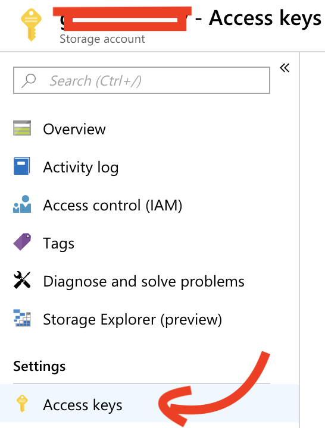

# Azure CLI

## :o: Installation

https://docs.microsoft.com/en-us/cli/azure/install-azure-cli


:pushpin: Windows

```
PS > choco install awscli
```

:pushpin: MacOS

```
% brew install awscli
```

## :a: Connexion à Azure


https://docs.microsoft.com/en-us/cli/azure/azure-cli-configuration


* Par le navigateur


```
$ az login
```
          Note, we have launched a browser for you to login. For old experience with device code, use "az login --use-device-code"
          You have logged in. Now let us find all the subscriptions to which you have access...
          [
            {
              "cloudName": "AzureCloud",
              "id": "bdb45149-xxx6-4e2e-ax41-ea80x269833d",
              "isDefault": true,
              "name": "GDOX-Pay-As-You-Go",
              "state": "Enabled",
              "tenantId": "xxx0x6x6-xx1x-462c-b141-d05a8c36xxx5",
              "user": {
                "name": "me@bmycompany.com",
                "type": "user"
              }
            }
          ]

* Par le CLI

[sign-in-with-credentials-on-the-command-line](https://docs.microsoft.com/en-us/cli/azure/authenticate-azure-cli?view=azure-cli-latest#sign-in-with-credentials-on-the-command-line)

:computer: Sous Powershell

```
PS > $AzCred = Get-Credential -UserName 000000000@collegeboreal.ca
```

```
PS > az login -u $AzCred.UserName -p $AzCred.GetNetworkCredential().Password
```

:apple: Sous `bash` 

```
$ read -sp "Azure password: " AZ_PASS && echo && az login -u 000000000@collegeboreal.ca -p $AZ_PASS
```

:warning: Attention `read` ne marche pas sous `zsh` passer en bash en tapant `% bash`

https://stackoverflow.com/questions/14141933/zsh-read-q-broken-on-osx


* Récuperer le numero d'abonnement `subscription`

```
% az account get-access-token                       
{
  "accessToken": "eyJ0eXAiOiJKV1QiLCJhbGciOiJSUzI1NiIsIng1dCI6IllNRUxIVDBndmIwbXhv...",
  "expiresOn": "2020-04-04 14:37:15.234302",
  "subscription": "0b1ddmnnd-3bca-4529-xxxx-fa3xxxxxxxcb5",
  "tenant": "53b8fc33-3145-431b-xxxxx-8xxxxxd533",
  "tokenType": "Bearer"
}
```


* Repérer les jetons d'accès `Access Tokens`

```
% ls  ~/.azure 
accessTokens.json
az.sess
clouds.config
config
telemetry
az.json
azureProfile.json
commands
logs
telemetry.txt
```

https://mikhail.io/2019/07/how-azure-cli-manages-access-tokens/

## :b: AZ Storage

### :one: Récupérer la clé pour le `Storage`



### :two: Fichier de configuration

[CLI Configuration File](https://docs.microsoft.com/en-us/cli/azure/azure-cli-configuration?view=azure-cli-latest#cli-configuration-file)

* Stocker la clé d'accès au `Storage` dans le fichier de configuration suivant

```
~/.azure/config
[storage]
account = myBlob
key = sdsdsdrsdsdsd/s=DFFF-+da7h2xlQCjS9Z3TxmI8FyMBlYjXI5nqNXOnoM783zeHpA==

```

* Storage Command

```
$ az storage account keys list -g MyResourceGroup -n MyStorageAccount
```

* Listing a blob in a directory (i.e. Bucket)

```
$ az storage blob list --container-name myContainer --output table
```

* Uploading a folder

```
$  az storage blob upload-batch --destination myContainer --source myLocalFolder
```

* Uploading a file

```
$ az storage blob upload --container-name myContainer --name myfile.docx -f ~/myfile.docx
```

* Deleting a file

```
$ az storage blob delete --container-name myContainer --name myfile.docx
```

https://docs.microsoft.com/en-us/cli/azure/storage/blob


